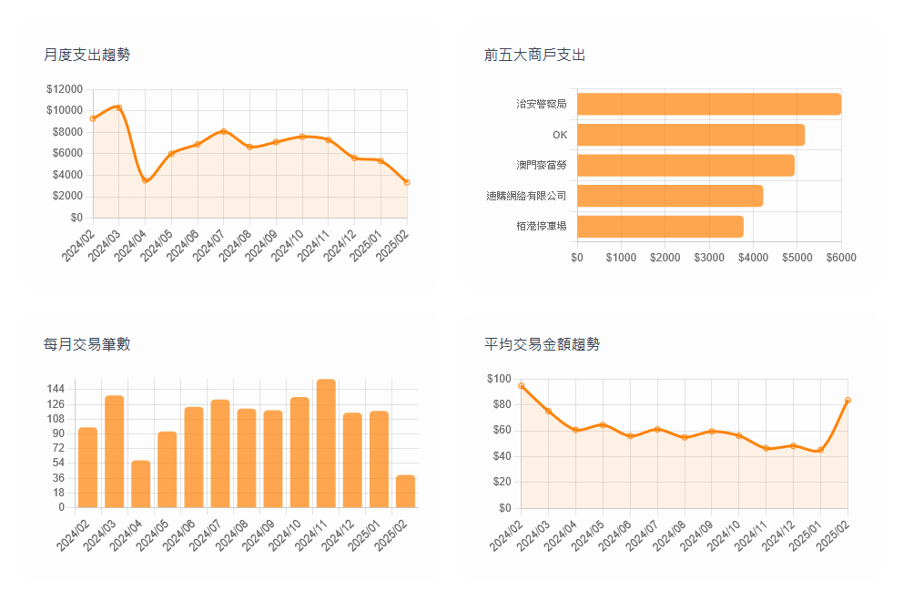

# MPAY.WORK - 智能支出分析工具｜個人理財與財務視覺化

MPAY.WORK 是一款基於網頁的 **智能支出分析工具**，專為個人理財與財務數據視覺化而設計。透過 Excel 檔案匯入、自動生成多種圖表及深入數據分析，MPAY.WORK 幫助用戶輕鬆掌握支出狀況，並提供關鍵財務指標。所有數據均在瀏覽器端處理，保障用戶隱私，無需伺服器支持。

  

**關鍵字**：MPAYWORK、MPAY支出分析、智能支出、個人理財、財務視覺化、Excel 匯入、前端應用、無伺服器、隱私保護、數據分析工具

---

## 目錄

- [功能特點](#功能特點)
- [數據要求](#數據要求)
- [主要分析功能](#主要分析功能)
- [技術架構](#技術架構)
- [隱私說明](#隱私說明)
- [使用方法](#使用方法)
- [瀏覽器支援](#瀏覽器支援)
- [開發說明](#開發說明)
- [授權條款](#授權條款)

---

## 功能特點

- 📊 **Excel 檔案匯入**：快速導入財務數據，支援標準格式
- 📈 **多種數據視覺化圖表**：自動生成月度趨勢圖、統計圖表，助你掌握財務狀況
- 📱 **響應式設計**：桌面與行動裝置均提供極佳使用體驗
- 🔍 **商戶支出搜尋與排序**：精確查找與比較各項支出數據
- 📅 **月份支出趨勢分析**：追蹤每月財務變化，輔助預算管理
- 💰 **關鍵財務指標計算**：量化分析，幫助做出明智的理財決策

---

## 數據要求

MPAY.WORK 支援的 Excel 檔案需符合以下欄位順序：

1. 交易ID
2. 日期時間
3. 商戶名稱
4. 交易類型（「交易」或「轉入」）
5. 備註/附加資訊
6. 金額
7. 付款方式/其他資訊

---

## 主要分析功能

  

- **總體分析**
  - 統計支出總筆數
  - 計算支出總金額

- **圖表分析**
  - 月度支出趨勢圖
  - 前五大商戶支出分析
  - 每月交易筆數統計
  - 平均交易金額趨勢

- **月度分析**
  - 每月支出總額與交易數量
  - 每月平均交易金額
  - 每月最大單筆支出

- **商戶分析**
  - 詳細商戶支出明細表
  - 支援按商戶名稱搜尋
  - 支援多欄位排序

---

## 技術架構

- **HTML5**：標準化網頁結構
- **Tailwind CSS**：現代化、高效的 CSS 框架
- **JavaScript**：前端互動與邏輯處理
- **Chart.js**：強大圖表視覺化工具
- **SheetJS**：Excel 檔案解析與處理

---

## 隱私說明

所有數據均在用戶瀏覽器本地處理，不會上傳到任何伺服器。數據分析結果暫存在瀏覽器的 localStorage 中，使用者可隨時清除，全面保障個人隱私。

---

## 使用方法

1. 訪問 [MPAY.WORK](#) 網站
2. 點擊上傳按鈕，選擇符合格式的 Excel 檔案
3. 等待數據自動分析與圖表生成
4. 查看並深入探索支出數據與財務趨勢
5. 使用搜尋與排序功能，獲取詳細商戶支出資訊

---

## 瀏覽器支援

MPAY.WORK 支援以下瀏覽器，確保最佳使用體驗：

- **Chrome**（推薦）
- **Firefox**
- **Safari**
- **Edge**

---

## 開發說明

本專案採用純前端技術架構開發，無需後端服務。若要在本地環境進行開發，請按照以下步驟操作：

1. 複製專案到本地
2. 使用任意網頁伺服器（例如 [Live Server](https://marketplace.visualstudio.com/items?itemName=ritwickdey.LiveServer)）啟動專案
3. 在瀏覽器中訪問對應地址進行開發與調試

---

## 授權條款

本專案遵循 [MIT License](LICENSE) 授權條款，歡迎自由使用與修改！
